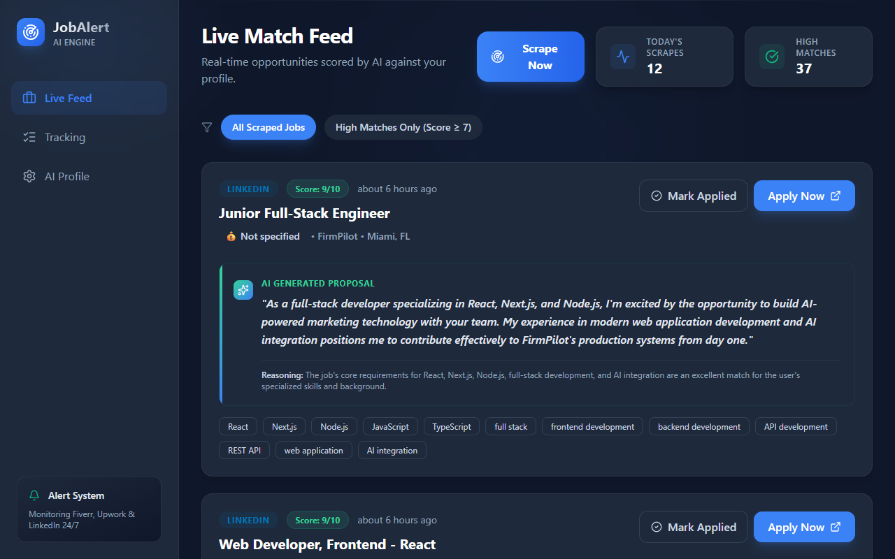
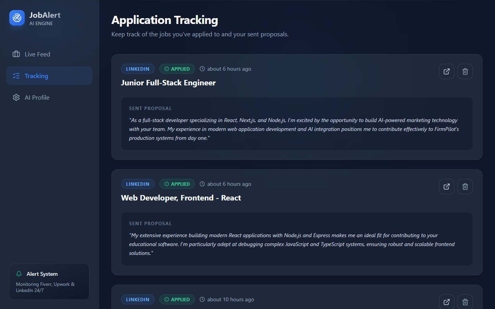
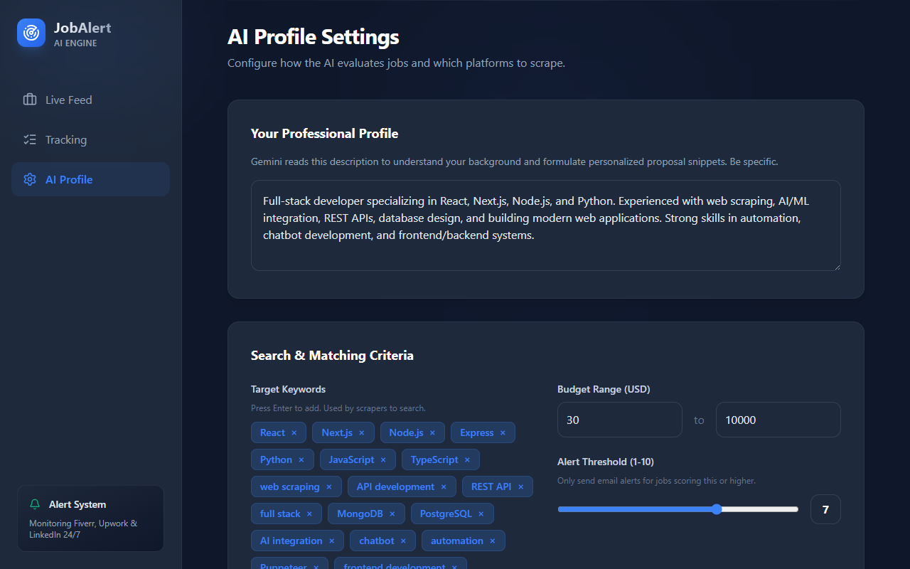

# 🤖 AI Job Alert System

An intelligent, full-stack automation system that aggregates freelance job postings from **LinkedIn** and **Upwork**, evaluates them using **Google Gemini AI**, and delivers high-quality leads via a modern dashboard and instant email alerts.

---

## 🌟 Key Features

- **🔍 Smart Aggregation**: Automatically scrapes real-time job listings from LinkedIn and Upwork using Apify.
- **🧠 AI-Powered Scoring**: Uses **Gemini 1.5 Flash** to score jobs (1-10) based on your custom skills profile.
- **🎯 Precise Matching**: Automatically filters out low-quality leads (Score < 5) to keep your feed relevant.
- **📧 Instant Alerts**: High-match jobs (Score 7+) trigger immediate email notifications with AI-generated proposal snippets.
- **💻 Modern Dashboard**: A sleek React-based "Live Match Feed" with real-time updates and filtering.
- **🚀 One-Click Apply**: Direct links to job postings with pre-written AI proposal reasoning.

---

| 📊 Live Match Feed | 🚀 Job Tracking |
| :---: | :---: |
|  |  |

| ⚙️ AI Profile & Settings |
| :---: |
|  |


---

## 🛠️ Technology Stack


- **Frontend**: React.js, Vite, Tailwind CSS, Framer Motion, Lucide Icons.
- **Backend**: Node.js, Express.js, better-sqlite3.
- **AI Engine**: Google Gemini 1.5 Flash API.
- **Automation**: Node-cron (Scheduling), Nodemailer (Emailing).
- **Scraping**: Apify Client (Upwork & LinkedIn Actors).

---

## ⚙️ Installation & Setup

1. **Clone the Repository**:
   ```bash
   git clone https://github.com/Muhammad-Fasihullah/AI-Job-Alert-System.git
   ```

2. **Backend Setup**:
   ```bash
   cd backend
   npm install
   # Configure your .env file with GEMINI_API_KEY, APIFY_API_KEY, and GMAIL credentials
   node src/index.js
   ```

3. **Frontend Setup**:
   ```bash
   cd frontend
   npm install
   npm run dev
   ```

4. **Environment Variables**:
   - `GEMINI_API_KEY`: For AI job scoring.
   - `APIFY_API_KEY`: For Upwork scraping.
   - `GMAIL_USER` & `GMAIL_APP_PASSWORD`: For email alerts.

---

## 👨‍💻 Author

**Muhammad Fasihullah**  
*Full Stack Developer*

🔗 [GitHub Portfolio](https://github.com/Muhammad-Fasihullah)  
📧 [Email Me](mailto:your.email@example.com)  
🔗 [LinkedIn Profile](https://www.linkedin.com/in/your-profile)  

---

## 📜 License

This project is licensed under the MIT License.
